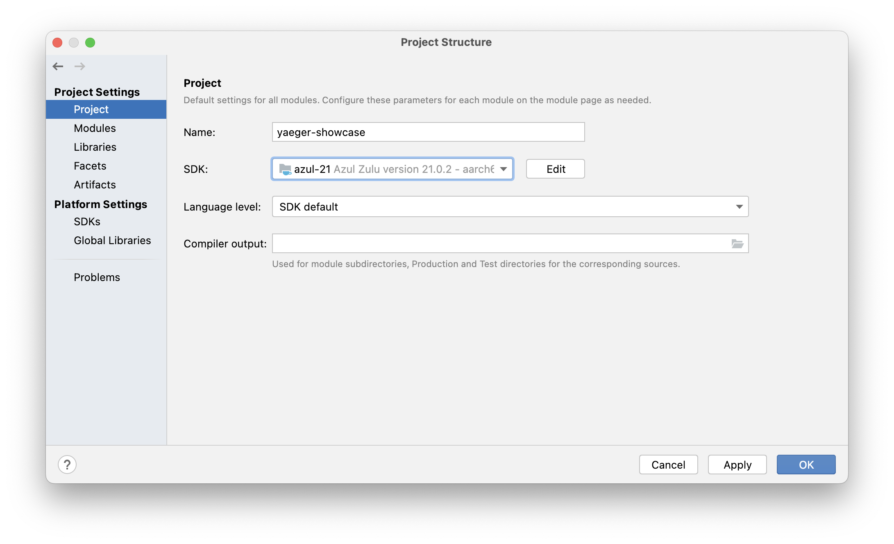
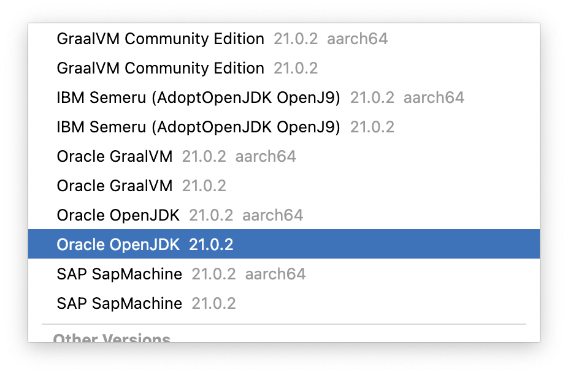
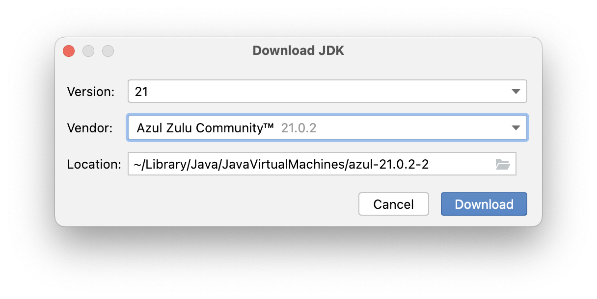

# FAQ

This chapter will sum up known issues and solutions on how to bypass them. The
list is likely not complete, so do feel free to share your findings.

Some of the issues noted here can be seen as bugs, but that does not mean they
are easily resolved.

## My MP3 file is not being played

For some reason, not all MP3 files are supported. If playing an MP3 file does
not give any exceptions, but you can not hear it in game, it might be because
the MP3 file is not supported. To correct this, use
[a tool](https://online-audio-converter.com/) to create an MP3 file that is
supported.

## An entity behaves strangely when colliding

Sometimes an entity behaves unexpected when colliding. For instance, it is set
to change its direction on collision, but when this happens it doesn't
immediately do so. First it seems to stutter a few times, after which it
finally behaves as expected.

This behaviour likely follows from the fact that the bounding box is used for
collision detection, and the bounding box is usually larger that the entity we
can see. Especially if the entity is a `SpriteEntity` containing a round image,
the bounding box is still rectangular. When this `SpriteEntity` is also
rotating, it is not unlikely that the angles of the rectangular bounding box
will again cause a collision on the Game World Update after the first collision.
Because of the second collision the entity will again change its direction
and this cycle can repeat itself until the entity no longer collides.

A workaround could be to use a `CompositeEntity` with a smaller hit box.

## I use tile maps, timers and entities on the same scene, why not add everything in the `setupEntities()` method?

Each `YaegerScene` exposes the method `setupEntities()`, which should be used
to add instances of `YaegerEntity` to the scene. When tile maps are required,
the scene should implement the interface `TileMapContainer`, after which
the method `setupTileMaps()` gets exposed and the method `addTileMap(TileMap)`
becomes available. The same goes for timers through the interface
`TimerContainer`.

In a Scene where either tileMaps or timers are required, it is very well
possible to ignore the `setupTileMaps()` or `setupTimers()` methods and add
TileMaps or Timers from the `setupEntities()` method. It is however preferable
to use the appropriate method, to maximize readability. Scenes can grow rather
large and to find specific entities, tile maps or timers, it can help to
group them within their specific methods.

## I have a machine with Apple Silicon (M1, M2, M3, etc.)

If you have a machine with Apple Silicon you might come across an error in the build process like this:

To solve this you have to change the architecture of your JDK to one that is not specific to an ARM CPU.

Go to Project Structure, through File->Project Structure or enter the keycombo: `⌘+;`.

You will see something similar to this:

Click on Edit next to the SDK overview and then choose `Download JDK`.

Then choose a JDK that does not have the descriptor: `aarch64`.

To finish click download.

You should be able to build and run your project now.
